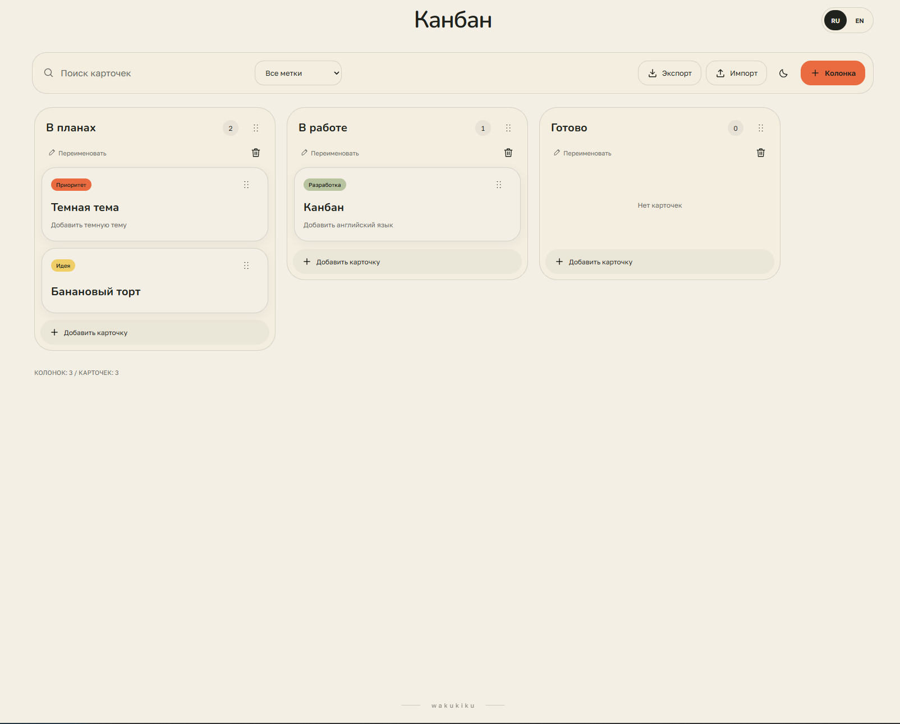
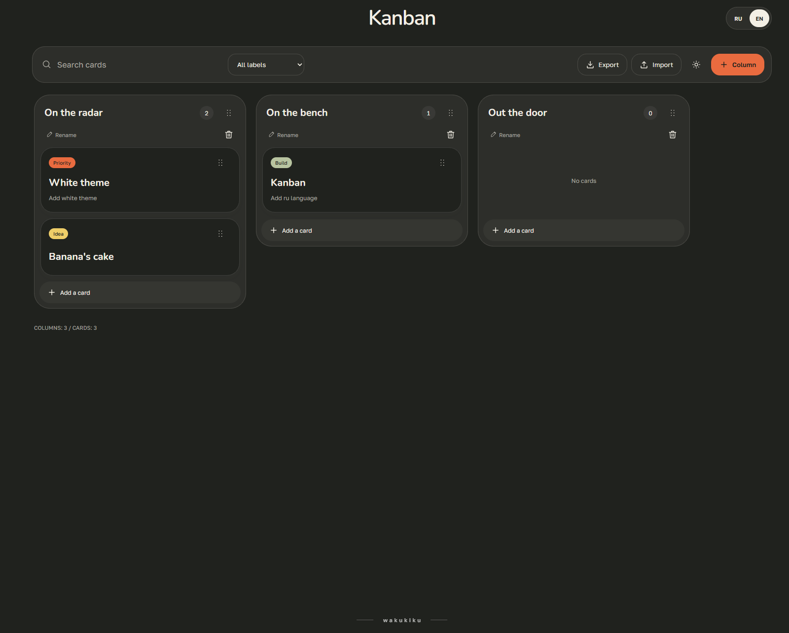

### `README.en.md`

````markdown
# Kanban Press

[Русская версия](./README.md)

A minimalist Kanban board for organizing tasks directly in the browser.

Cards and columns can be created, edited and rearranged with drag & drop. The interface supports light and dark themes, English and Russian languages, search, labels, deadlines and local data storage.

### [Open live demo →](https://kanban-cyan-six.vercel.app/?lang=en)

## Preview

### Light theme · RU



### Dark theme · EN



## Features

- create, edit and delete cards;
- create, rename and delete columns;
- drag & drop cards between columns;
- reorder columns;
- card search;
- label filtering;
- task labels;
- deadlines;
- light and dark themes;
- English and Russian interface;
- board persistence with `localStorage`;
- JSON import and export;
- keyboard-accessible drag & drop;
- responsive interface;
- persistent `wakukiku` author mark.

## Stack

- React 18
- Vite
- JavaScript
- CSS
- dnd-kit
- LocalStorage

## Languages

The language can be changed directly in the interface.

Dedicated links are also available:

- [English version](https://kanban-cyan-six.vercel.app/?lang=en)
- [Русская версия](https://kanban-cyan-six.vercel.app/?lang=ru)

The selected language is saved in the browser.

## Local-first storage

Kanban Press follows a local-first approach.

The board is stored locally in the browser and does not require an account or backend connection.

Boards can also be exported as JSON for backup or transfer and imported later.

## Local development

```bash
git clone https://github.com/wakukiku/kanban.git
cd kanban
npm install
npm run dev
```
````
